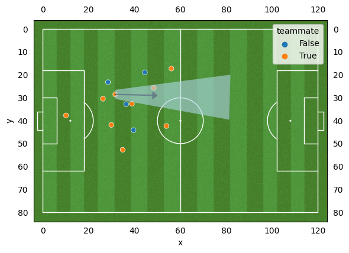
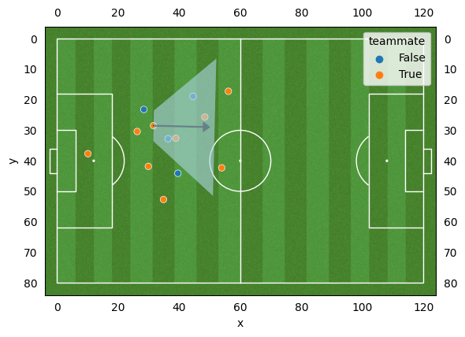
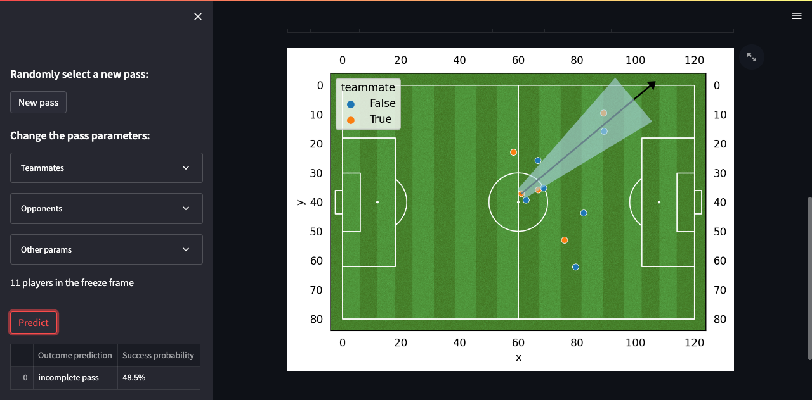

# xpass-project

`xpass-project` is a football Machine Learning and Deep Learning project aimed at **evaluating the success probability of a pass**.

This project starts with a simple approach, which consists of summarizing the spatial information of the position of players on the pitch at the time of the pass into a highly simplified tabular dataset.

In future work, we will develop a second approach, in which we will use a Graph Neural Network to ingest the players' positional data.

# Table of contents

1. Statsbomb passes data
    - Data Source
    - Feature Selection and Data Transformation
    - Extracting relevant information from the freeze frames data: The reception shape method
2. Training, Calibration and Evaluation
    - Dealing with data imbalance
    - Evaluation
3. Predictions on Streamlit app
4. Future work: The Deep Learning approach

# 1. Statsbomb passes data

## Data Source

The training data comes from Statsbomb open data (link here : [STATSBOMB OPEN DATA](https://github.com/statsbomb/open-data)).

For training, the model can use any event data that is a pass, on the condition that the data incorpores a freeze_frame value (i.e. the position of all the players on the pitch at the moment of the pass, provided that they are visible on broadcast).

By default, we use data from male competitions only. But we can train the model on male, female or all competitions where freeze frames are available, by specifying this parameter in the `.env` file.

## Feature Selection and Data Transformation

Since our main goal is to evaluate the likeliness that a pass will be successful or not, we will only take into consideration features the passer control and/or decide at the moment of the pass. This implies removing data that we cannot reliably relate to the passer’s initial intention.

In particular, the `pass_length` feature cannot be reliably related to the passer’s intention and is not 100% under the passer’s control. While we may assume that the `pass_length`  reflects the player’s intention for successful passes, it is not the case for incomplete passes where the pass length may vary due to clumsiness, the pass being blocked by an opponent, or the recipient player not being able to control the ball or misunderstanding the passer’s intent.

We decide to keep the `pass_angle` feature as we think it is much more likely to being close to the passer’s initial intention.

We also keep the following features: `play_pattern_name`, `pass_height_id`, `pass_body_part_name`.

Last but not least, we will extract relevant information from the `freeze_frame` data (i.e. the positional information of players on the pitch).

## Extracting relevant information from the freeze frames data : The reception shape method

The Machine Learning approach requires to translate the information carried in the freeze frame data into new data that the model can understand.

Indeed, freeze frames are dictionaries that include team and position attributes, in which the order in which players appear in the structure is irrelevant.

All the players information in the freeze frames are not equally important, depending on the player’s ability to interact with the passer or receiver, either actively or passively.

We chose to help the model read the game by selecting a fragment of what is likely to be the most relevant information. We simply focus on the portion of the pitch that is in the direction of the pass, where teammates and opponents are more likely to receive the pass. We call this zone the “reception shape” and we count the number of teammates and opponents that are located in this area. And that is all the model will know at this point.

The reception shape is centered around the pass angle, and is defined by a corridor width, a corridor length and another angle alpha that create two triangles on each side of the corridor, resulting in a trapezoid shape.

The example bellow shows a reception shape with default parameters (`corridor_width` = 2 yards, `corridor_length` = 50 yards and angle `alpha` = 10°). In this example there is only one teammate in the reception shape and no opponent. We set these default parameters because they give a plausible information about players who are actually able to move into the right space and get control of the ball after the pass is made.

The example bellow shows the reception shape for the exact same pass, defined with another set of parameters (`corridor_width` = 5 yards, `corridor_length` = 20 yards and angle `alpha` = 45°). Now each team has two players in the reception shape. Of course, using this set of parameters result in overestimating the number of players that are actually able to receive the ball.

The reception shape approach has pros and cons. On the positive side, it is a good way to reduce the information provided by the freeze frames into a more compact information, keeping the data lighter and reducing training time. But limitations to this approach include the following points:

- All opponents and all teammates have the same value (i.e. they each count for one player in the reception shape), no matter how close they are to the passer and how likely they are to actually intercept or receive the ball.
- We only consider players located in the direction of the pass. Players located in the passer’s back are not considered even though they can put pressure on the passer or tackle the ball from the back.
- Statsbomb freeze frames do not display all 22 players on the pitch, but only the players visible on the broadcast.
- Statsbomb freeze frames do not provide the players’ direction and speed features.

# 2. Training, Calibration and Evaluation

## Dealing with data imbalance

The natural distribution of passes shows an imbalance between classes (i.e. between successful and unsuccessful passes). About 84% of passes are successful and 16% of passes are unsuccessful.
The training data needs to be balanced so that the model learns to correctly detect missed passes as well as successful passes. Without balancing, the model might be lazy, always predicting the most frequent outcome (i.e. that the pass is successful) and still have a good accuracy (but a very bad recall on unsuccessful passes). We will evaluate the model based on accuracy but also based on recall and precision for each class.

Training was performed on `25000+`passes, 50% successful passes and 50% incomplete passes.

Calibration and Evaluation were both performed on two distinct datasets, separated from the train dataset and kept imbalanced, in order to reflect the natural distribution of the classes.

## Evaluation

After cross validating different classification models and grid searching for the best hyperparameters, we found out that the best model for predicting successful and incomplete passes was a Random Forest Classifier.

Since Random Forest models are not probability-based models, the calibration step is necessary to adjust the predicted probabilities so that they better correspond to the actual probabilities.

After calibration, we get the following performance scores on the test dataset:

| Accuracy | Recall (successful passes) | Precision (successful passes) | Recall (incomplete passes) | Precision (incomplete passes) |
| --- | --- | --- | --- | --- |
| 0.8775 | 0.9310 | 0.9229 | 0.6070 | 0.6351 |

We successfully predicted close to 88% of passes, over baseline predictions that would consist in always predicting the most likely outcome - successful passes - that happens 83.5% of the time or to randomly predict the pass outcome with a 83.5% probability to predict a successful pass.

More importantly, we successfully predict that incomplete passes are indeed unsuccessful in 61% of cases (much better than the 16% of correct predictions for incomplete passes if we randomly predicted the pass outcomes to reflect their naturally imbalanced distribution).

# 3. Predictions on Streamlit app

A demo dataset was kept aside and not included neither in the training, calibrating nor evaluating steps. The app enables you to:

- load  passes in the Streamlit app and predict their outcome and their associated probability,
- create custom passes / adjust the pass parameters of randomly selected passes to visualize their impact on outcome predictions (for example, by changing the direction of the pass or adding/removing teammates or opponents in the reception shape).

# 4. Future work: The Deep Learning approach

In future work, we could improve the reception shape approach by grid searching the parameters that define the reception trapezoid and/or add complexity to the contextual information (for example: give different weights to players depending on their proximity to the passer or the potential receivers).

We also want to test a Graph Neural Network approach that would include a graph representation of the freeze frames.
